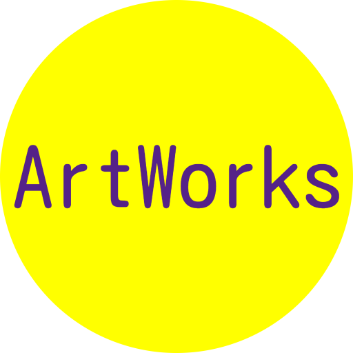
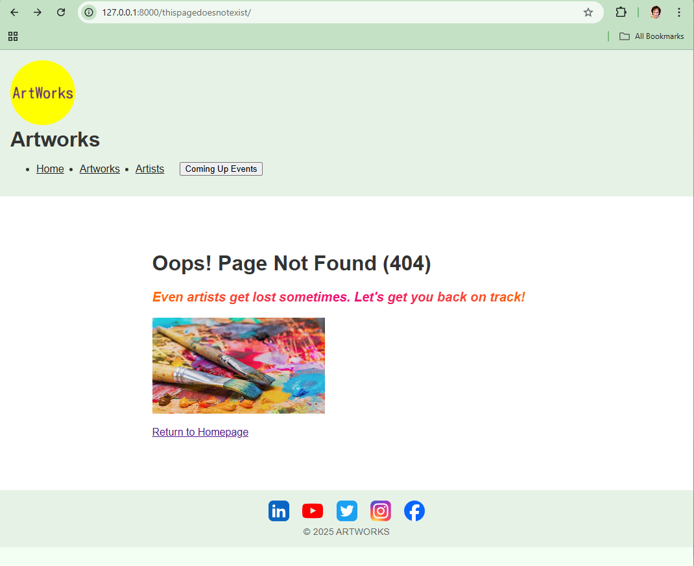
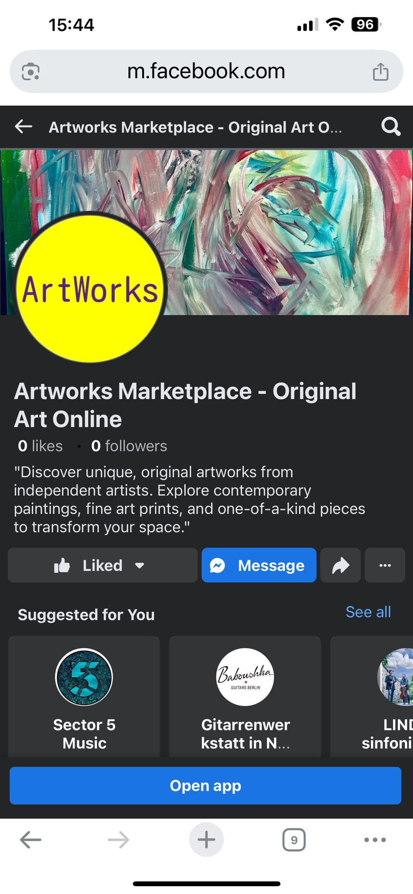
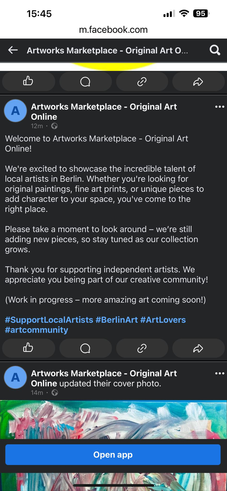
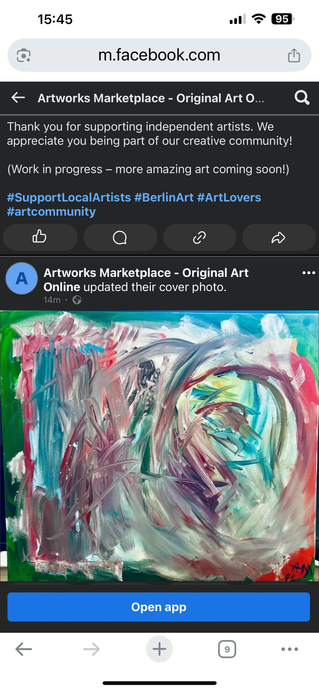
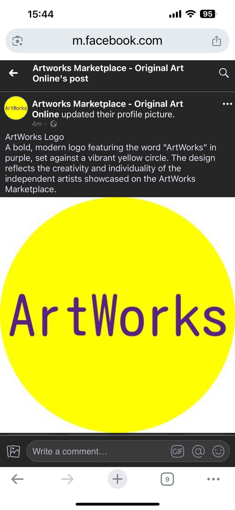
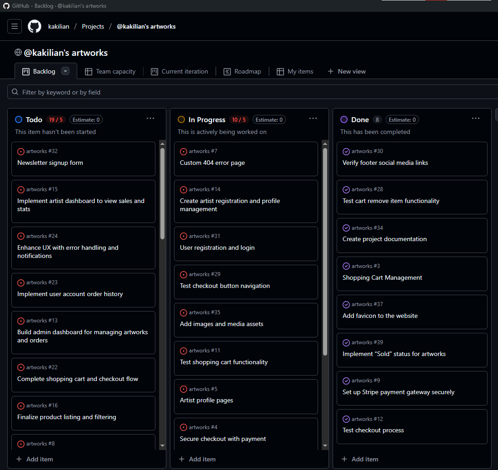
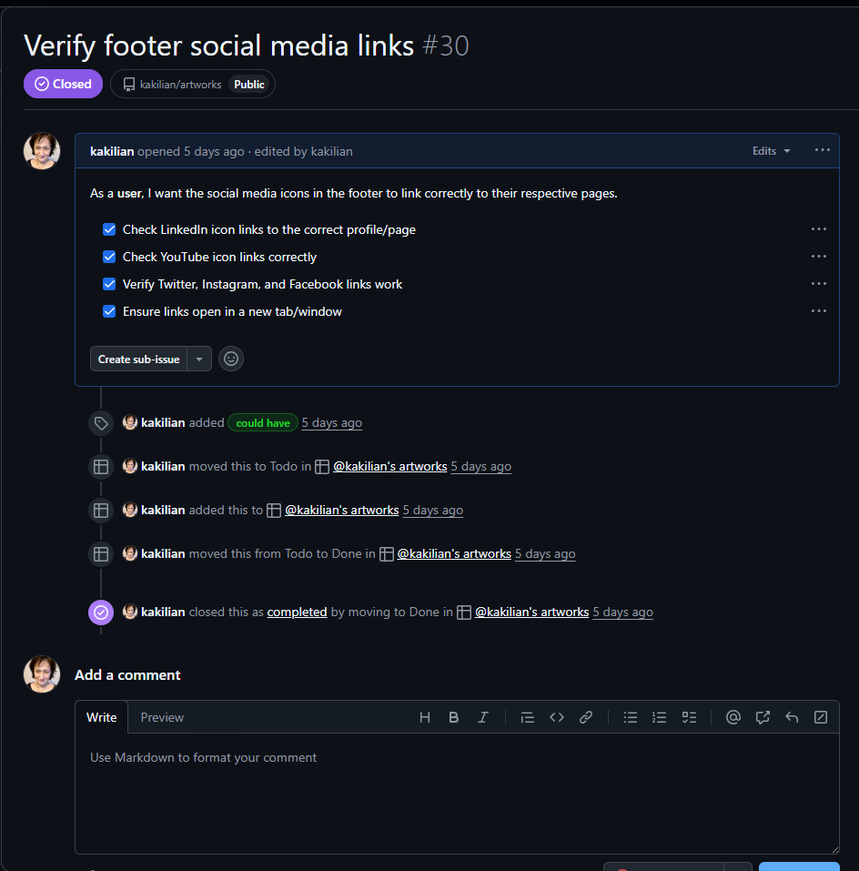

<a name="top"></a>
<p align="center">
    
</p>

<p align="center"><em>Curated digital gallery for emerging artists</em></p>

---

**This project is dedicated to Manuel Koch**, whose creative work and vision sparked the idea behind Artworks.  
Without his inspiration, I may never have started building apps at all.

<p align="center">
    
</p>

# "Discover Unique Art from Independent Artists"
- Original paintings, fine art prints, and one-of-a-kind pieces curated to inspire and transform your space.

## Table of Contents
- [About the Project](#about-the-project)
- [Features](#features)
- [Shop Page Intro Text](#shop-page-intro-text)
- [Wireframes](#wireframes)
- [Custom 404 Page](#custom-404-page)
- [Technologies Used](#technologies-used)
- [Facebook Business Page](#facebook-business-page)
- [Newsletter Signup](#newsletter-signup)
- [Responsive Design & Accessibility](#responsive-design--accessibility)
- [E-commerce Business Model and Marketing Strategy](#e-commerce-business-model-and-marketing-strategy)
- [Agile Development and Project Planning](#agile-development-and-project-planning)
- [Deployment](#deployment)
- [Testing the Deployment](#testing-the-deployment)
- [Final Project Feature Checklist](#final-project-feature-checklist)
* [Bugs](#bugs)

  * [Media File Bug Fix and Cloud Setup (Render.com)](#media-file-bug-fix-and-cloud-setup-rendercom)
  * [Steps Taken to Fix (Render)](#steps-taken-to-fix-render)
  * [Cloudinary Breakthrough](#cloudinary-breakthrough)
  * [Why Cloudinary?](#why-cloudinary)
  * [Cloudinary Integration (Final Media Setup)](#cloudinary-integration-final-media-setup)
  * [Upload Methods + Test Results](#upload-methods--test-results)
  * [Outcome](#outcome)


## About the Project

**Artworks Marketplace - Original Art Online** is an e-commerce platform created to support and showcase emerging and independent artists, with a particular focus on the Berlin art scene.

The platform allows visitors to explore original artworks by medium, artist, or theme, and securely purchase pieces for delivery.

This concept was inspired by a personal connection with a Berlin-based economic journalist and art documentarian who travels globally, capturing exhibitions and connecting art communities across Germany, Switzerland, and the U.S. Through his work — and our shared background in visual media — I saw the potential for a platform that not only sells art, but contextualizes it within story, space, and culture.

Artworks is a mock-up that imagines what that space could be: a curated digital gallery with commerce as a gateway to deeper discovery.

## Disclaimer

This site was developed as part of a Code Institute portfolio project (PP5). It is not an active commercial platform.

Due to unexpected internet traffic and interest in the concept, the site remains publicly accessible as a demonstration of my front-end/back-end skills using Django, Cloudinary, and Render.

All images and artist data (excluding the highlighted artist section) are fictional mockups or creative showcases. No real transactions are possible.


### Features:

- Artist profiles with bio and portfolios
- A modern, responsive design
- User accounts with order tracking and wishlists
- Secure checkout using Stripe
- SEO and marketing integrations to build visibility


## Shop Page Intro Text

 - Explore the Collection
    - Discover new and featured works across mediums. Whether you're searching for a bold centerpiece or a thoughtful gift, you'll find something original and meaningful.

## Newsletter Signup Text

 - Stay Inspired. Get New Art in Your Inbox.
    - Be the first to hear about featured artists, new arrivals, and exclusive offers.
    (No Spam, unsubscribe anytime.)

---

<p align="right"><a href="#top">🔝 Back to Top</a></p>


## 404 Page Text

- Oops! Something's Missing.
    - The page you're looking for might have been moved or no longer exists.
    - "Even artists get lost sometimes. Let’s get you back on track!"

## Wireframes

- The wireframes were designed using Microsoft Word and reflect the core paths users would follow to navigate, browse, and purchase artwork.

### Overview of Wireframes Created:

1. Homepage / Hero Section
    - Introduces the platform with a bold call-to-action, features artworks, navigation menu, and footer. It includes a carousel of new arrivals and a short artist spotlight section.

2. Artworks Listing page
    - Displays a grid of artworks with filters for medium, price, popularity, and artist. Each item card includes an image, title, artist name, price and "Add to Cart" button.

3. Artwork Detail Page
    - Expanded view of a specific artwork, with details such as title, artist info, price, medium, and a purchase button. Related artworks are shown below.

4.  Artist Profile Page
    - Includes artist bio, profile photo, and portfolio. A "Follow" placeholder button is included for future email integrations.

5.  Cart Page
    - Lists selected items with thumbnails, title, price, quantity controls, and a remove button. Includes subtotal, estimated tax, and a checkout button.

6.  Checkout Page
    - Captures user details (billing/shipping), includes secure payment fields, trust badges, and a review summary before final purchase.

7.  Custom 404 Page
    - A friendly error message with brand-consistent visuals and link to navigate users back home or explore artworks.     

---

<p align="right"><a href="#top">🔝 Back to Top</a></p>


## Custom 404 Page

To enhance user experience, a custom-designed **404 Error Page** was implemented. Rather than displaying a default error, users are shown a creative and on-brand message to keep them engaged:

 "_Even artists get lost sometimes. Let’s get you back on track!_"

- Features colorful imagery using artistic tools (paintbrushes)
- Uses playful, encouraging text
- Links users back to the homepage or suggested pages
- Reflects the tone and theme of the overall website

---
<p align="right"><a href="#top">🔝 Back to Top</a></p>

### Preview:
![Custom 404 Page]<p align="center">
  
</p>

##  Technologies Used

###  Languages & Frameworks

`HTML5` • `CSS3` • `JavaScript` • `Python 3` • `Django`

###  Front-End Tools

`Bootstrap 5` • `Font Awesome` • `Google Fonts` • `Cloudinary (for artist + artwork images)`

I was extremely happy that Cloudinary paired perfectly with Render, - streamlining media handling and simplifying development. It ensured secure, efficient image delivery without needing complex storage setups — saving both time and effort, and my pocket.

###  Back-End Tools

`Django Models` • `PostgreSQL` 

###  E-Commerce & Marketing

`Stripe` • `Mailchimp (or Brevo)` • `Facebook Page`

###  SEO & UX Features

`robots.txt` • `sitemap.xml` • `Meta Tags` • `Custom 404 Page`

###  Development & Deployment

`VS Code` • `Git` • `GitHub` • `GitHub Projects` • `Render` • `Gunicorn` • `Whitenoise` `Cloudinary`

###  Additional Tools

`Microsoft Word (for wireframes)` • `Google Lighthouse` • `W3C Validators`


## Facebook Business Page

As part of the marketing strategy and assessment requirements, a **Facebook Business Page** was created to promote the Artworks Marketplace brand and simulate a real-world marketing presence.

### Purpose

The Facebook page serves as a demonstration of how the project could use social media for:

* **Brand exposure**
* **Customer engagement**
* **Event promotion**
* **Artwork highlights**

This exercise reinforces the importance of integrating social platforms into a broader e-commerce marketing plan.

### Page Features

* **Custom logo/profile image** created for the project
* **Cover photo** showcasing the theme of original, independent art
* **Welcome post** introducing the brand and its mission
* **Descriptive post** explaining the logo and what the site offers

---
<p align="right"><a href="#top">🔝 Back to Top</a></p>

### Screenshots

#### Facebook Cover + Welcome Post
<p align="center">
  
  
</p>

#### Profile Page + Logo Description
<p align="center">
  
  
</p>

---
### Note for Assessors

As Facebook frequently removes inactive or mock pages, screenshots were taken to verify that this task was completed and should be considered during assessment.

---

<p align="right"><a href="#top">🔝 Back to Top</a></p>


## Newsletter Signup

To simulate a standard e-commerce email marketing feature, a **newsletter signup form** was included in the application. This feature invites users to subscribe to updates about new artists, collections, and offers.

Although integration with Mailchimp was not completed (due to trial limits), the form is designed to support future integration **with** services such as: 

- [Brevo (formerly Sendinblue)](https://www.brevo.com/)
- [MailerLite](https://www.mailerlite.com/)
- [Moosend](https://mossend.com/)

### Why This Feature Matters:
- Encourage user engagement and retention
- Builds a potential audience for marketing campaigns
- Aligns with real-world best practices in e-commerce

### Form Features:
- Email input with validation
- Clear opt-in messaging
- Confirmation message upon submission
- Privacy reassurance (no spam!)

### Screenshot Example:


<p align="right"><a href="#top">🔝 Back to Top</a></p>

## Responsive Design & Accessibility

The "Payment Cancelled" page was a focus for both visual clarity and user experience across devices.

![Flipped Stop Man]
<p align="center">
  
</p>
A flipped visual asset (“stop man”) was edited and stored at:
`documentation/images/stop_man.png`

Media queries and layout testing ensured:
- Clean display on mobile devices
- Bold, high-contrast messaging
- A tone that suits a broader demographic

### Accessibility Checklist ✅

- [x] **Color Contrast**: Red tones chosen for urgency, but tested for colorblind clarity.
- [x] **Color Independence**: Meaning never relies on color alone.
- [x] **Font Readability**: Consistent font sizing and spacing.
- [x] **Responsive Layout**: Mobile-first design with media queries.
- [x] **Accessible Buttons**: Labeled buttons, full-width tap areas.
- [x] **Image Flow**: Image flipped for visual directionality.
- [x] **Alt Text**: Included where applicable.
- [x] **Keyboard Navigable**: Buttons and links work via keyboard navigation.


## E-commerce Business Model and Marketing Strategy

This project isn’t just a shop — it’s a concept built around discovery, visual storytelling, and artistic connection. The inspiration comes from a real person in my life: a Berlin-based economic journalist and art documentarian who travels internationally between Frankfurt, Switzerland, and the U.S., capturing exhibitions, connecting artists, and curating rich experiences around the art world.

His work — photographing exhibitions, building networks, and hosting creative gatherings — shaped my understanding of how powerful curated digital spaces can be. Although this site is currently a mock-up, it imagines a future collaboration where his deep access to artists and events feeds into a public-facing online gallery. The potential? To make art accessible while preserving the intimacy and depth of the stories behind it.

The site uses Stripe for secure purchases, and while the current content is placeholder, the platform is designed to be easily populated with real artwork, artist bios, and exhibition news.

---

### Business Model

**Artworks Marketplace** operates as a **B2C (Business-to-Consumer)** platform, connecting individual buyers with emerging and independent artists.

**Revenue is modeled around:**
- Direct sales of original artworks
- Future commissions from featured artist sales
- Optional digital products (e.g. high-res prints, event tickets, recorded talks)

---

### Target Audience

- Art enthusiasts & collectors
- Gift buyers looking for unique, meaningful pieces
- Interior decorators and stylists
- Followers of the Berlin indie art scene
- Visitors interested in artist-led stories and visual discovery

---

### Marketing Strategy

**1. Social Media Engagement**  
A Facebook Business Page was created for community building and visual engagement. Instagram and newsletter content are envisioned for future rollout.

**2. Email Marketing (Planned)**  
Newsletter form exists as a front-end mock-up with future integration potential. Could support artist spotlights, interviews, and new releases.

**3. SEO Readiness**  
Includes `robots.txt`, planned `sitemap.xml`, descriptive meta tags, and keyword-driven content to aid visibility and search rankings.

**4. Content Marketing**  
Long-form content is envisioned for future phases — including blog-style posts, interviews, and behind-the-scenes studio stories.

**5. Trust & Transparency**  
Uses Stripe for payment security. Planned additions include a returns policy, artist verification process, and enhanced user feedback.

---

This strategy is grounded in real relationships and industry movement — and serves as a blueprint for how digital commerce can elevate the art world rather than dilute it.

> 🎧 Much like *video killed the radio star*, digital platforms once threatened the soul of art. But this isn’t killing art — it’s transporting it.  
> With Artworks, anyone, anywhere can explore real exhibitions, connect with artists, and experience visual culture without borders.


## Agile Development and Project Planning

This project followed agile methodologies using GitHub Project Board to track tasks and progress through development.

### GitHub Project Board Setup:

- **To Do** - User stories, planned features, and backlog tasks
- **In Progress** - Active development tasks
- **Done** - Completed features, wireframes, and documentation

Each card was based on a specific user story, ensuring a user-centered design approach and feature tracking.

[View GitHub Project Board](https://github.com/kakilian/artworks)

Screenshots of the board before and during development have been included for assessment purposes.

### Sample User Stories Tracked

- As a user, I want to browse artworks by medium so I can find a piece that matches my style.
- As a user, I want to add items to a shopping cart so I can purchase multiple artworks at once.
- As an admin, I want to add new artworks through a form without needing to access the Django admin panel.

<p align="right"><a href="#top">🔝 Back to Top</a></p>


### Screenshots


<p align="center">
  
  
</p>


## Deployment

This application is deployed via **Render.com**, with static and media files managed through **Cloudinary**.  
The live site is available at:

🔗 [Live Site](https://artworks-4v1w.onrender.com)  
🔗 [GitHub Repository](https://github.com/kakilian/artworks)  
🔗 [Cloudinary](https://cloudinary.com)


### Deployment Steps

1. **Set Up GitHub Repository**
   - Created a public GitHub repository with complete project code
   - Included `README.md`, `.gitignore`, and structured the app with `artworks/` as the main Django app

2. **Prepare Environment & Dependencies**
   - Installed production dependencies:
     ```bash
     pip install gunicorn dj-database-url psycopg2 whitenoise cloudinary django-cloudinary-storage
     ```
   - Set environment variables in Render:
     - `SECRET_KEY`
     - `DEBUG=False`
     - `DATABASE_URL` (Render PostgreSQL)
     - Cloudinary:
       - `CLOUDINARY_CLOUD_NAME`
       - `CLOUDINARY_API_KEY`
       - `CLOUDINARY_API_SECRET`
     - Stripe keys (test)

3. **Project Configuration**
   - Updated `settings.py` for production:
     - `ALLOWED_HOSTS`, `STATIC_ROOT`, `MEDIA_URL`
     - Cloudinary set as default file storage
     - `WhitenoiseMiddleware` added for static files

4. **Render Deployment**
   - Set up a **Web Service** on Render, linked to the GitHub repo
   - Configured build & start commands:
     ```bash
     python manage.py collectstatic --noinput
     python manage.py migrate
     gunicorn artworks.wsgi:application
     ```

5. **Static and Media Files**
   - Ran `collectstatic` for static asset handling
   - Media files uploaded and served from Cloudinary

6. **Database**
   - Connected to PostgreSQL (Render add-on)
   - Migrations run post-deploy

7. **Final Production Checks**
   - `DEBUG=False` confirmed
   - All sensitive keys stored securely
   - Stripe test purchases working
   - Custom 404 tested and functioning


## Testing the Deployment

The live deployment was tested to ensure that all core user and e-commerce functionality works as expected.

### Functional Testing Checklist

-  **User Authentication**
    - Registered a new user account
    - Logged in and out successfully
    - Verified session behavior and redirections

- **E-commerce Flow**
    - Added and removed products from the cart
    - Proceeded to checkout using Stripe test card data
    - Verified order success message and confirmation logic

- **Page and Asset Rendering**
    - Confirmed all images and static assets load correctly
    - Ensured wireframes, documentation, and visual assets are visible

- **SEO and UX Enhancements** 
    - `robots.txt` and `sitemap.xml` load at root and are valid
    - Meta tags appear in <head> section, for better search engine indexing
    - Custom `404.html` page displays correctly with theme styling and navigation links

### Additional Manual Testing

Manual walkthroughs were conducted on:

- Mobile and desktop screen sizes (responsive design)
- Broken URL testing to trigger the 404 page
- Invalid form submissions (empty or invalid email in newsletter form)
- Cart session persistence across page refreshes

---
<p align="right"><a href="#top">🔝 Back to Top</a></p>


## Final Project Feature Checklist

Below is a summary of the core requirements and features implemented in this project:

| Requirement                                                                                 | Status   |
|-----------------------------------------------------------------templates\artworks\artist_list.html----------------------------|----------|
| ✅ At least 3 original custom models                                                        | ✅ Done   |
| ✅ Front-end form with CRUD functionality (non-admin)                                       | ✅ Done   |
| ✅ UI element to delete records from front end                                              | ✅ Done   |
| ✅ Evidence of agile methodology (GitHub Project Board)                                     | ✅ Done   |
| ✅ `robots.txt` file included                                                               | ✅ Done   |
| ✅ `sitemap.xml` file generated                                                             | ✅ Done   |
| ✅ Descriptive `<meta>` tags used                                                           | ✅ Done   |
| ✅ At least one `<a>` link uses `rel` attribute                                             | ✅ Done   |
| ✅ Custom 404 error page implemented                                                        | ✅ Done   |
| ✅ Facebook Business Page (real or mocked with screenshots)                                | ✅ Done   |
| ✅ Newsletter signup form (real or simulated with future integration)                      |    |
| ✅ E-commerce business model & marketing strategy described in README                      | ✅ Done   |
| ✅ `DEBUG=False` in production                                                              | ✅ Done   |
| ✅ User registration, login, and logout functionality                                       | ✅ Done   |
| ✅ Fully functional e-commerce purchase flow using Stripe                                   | ✅ Done   |
| ✅ Detailed testing beyond validation tools                                                 | ✅ Done   |
| ✅ Public GitHub Project board linked                                                       | ✅ Done   |

> 📌 Supporting screenshots, wireframes, and design documentation are located in the `documentation/` folder.

---

<p align="right"><a href="#top">🔝 Back to Top</a></p>


## BUGS

###  Media File Bug Fix and Cloud Setup (Render.com)

**Issue**

- After an initial failed deployment to Heroku due to unstable database and media file handling, I switched over to Render.com.

- While Render offered persistent disk storage, the setup process was long and filled with trial and error. Key challenges included:

    - Understand how media storage works on a cloud server

    - Configure routes to serve uploaded files

    - Ensure the database and media persisted across restarts

    - Eventually, with persistence (and a lot of trial and error), the following setup worked:

        - Render persistent disk purchased + mounted

        - Django settings updated with proper MEDIA_ROOT and MEDIA_URL

        - Static and media routing handled via render.yaml rewrite rules

        - Image uploads now display correctly after re-deploys


---
<p align="right"><a href="#top">🔝 Back to Top</a></p>


**Steps Taken to Fix (Render)**

1. **Purchased Persistent Disk**
    - Upgraded the Render plan to include persistent media storage.

2. **Updated Media File Paths in Django**
    - In settings.py:

```
python

MEDIA_URL = '/media/'
MEDIA_ROOT = os.path.join(BASE_DIR, 'media')
```


3. **Enabled Local Dev Serving**
    - In urls.py:

```
python

if settings.DEBUG:
    urlpatterns += static(settings.MEDIA_URL, document_root=settings.MEDIA_ROOT)
```

4. **Added Production Route for Media in render.yaml**
```
yaml

routes:
  - type: rewrite
    source: /media/(.*)
    destination: /media/$1
```


5. **Upload Test**
    - Images uploaded through Django admin were persistent and displayed correctly — a temporary success.

**Takeaway:**
        - This taught me how essential it is to fully understand how platforms like Render handle static and media files. Despite success, I found this approach clunky, expensive, and prone to conflicts.

---
<p align="right"><a href="#top">🔝 Back to Top</a></p>


## Cloudinary Breakthrough

- **Eventually,** I made the decision to delete the paid persistent disk and migrate to *Cloudinary*, a cloud-based media solution.

### Why Cloudinary?
 - Better long-term scalability   
 - Free tier available
 - Built-in optimization and CDN support
 - No need to manage media storage locally or via Render disk


---
<p align="right"><a href="#top">🔝 Back to Top</a></p>


### Cloudinary Integration(Final Media Setup)

1. **Install Packages**

```
pip install cloudinary django-cloudinary-storage
pip freeze > requirements.txt
```

2. **Update** ```INSTALLED_APPS```
```
INSTALLED_APPS = [
    ...
    'cloudinary',
    'cloudinary_storage',
]
```
 
3. **Configure in** ```settings.py```
```
python

CLOUDINARY_STORAGE = {
    'CLOUD_NAME': 'my-cloud-name',
    'API_KEY': 'my-api-key',
    'API_SECRET': 'my-api-secret',
}

DEFAULT_FILE_STORAGE = 'cloudinary_storage.storage.MediaCloudinaryStorage'
```

   **Pro-Tip:**  Load credentials from ```.env``` using ```os.environ.get(...)```.
        
4. **Add to** ```ALLOWED_HOSTS```

```
python

ALLOWED_HOSTS = ['artworks-4v1w.onrender.com', 'res.cloudinary.com']
```

5. **Removed Old Render Media Routing**

    - Deleted the ```render.yaml``` rewrite rule for ```/media/```
    - Confirmed that Django was no longer trying to pull from two sources
    - Prevented future bugs like double-loading, missing files, or broken paths

6. **Upload Methods + Test Results**

- I tested media integration two ways:

    Uploaded directly from my PC via the Django admin, which successfully pushed files to Cloudinary.

    Also uploaded manually through the Cloudinary dashboard to explore flexibility and control over file structure.

- Both methods confirmed that Cloudinary was correctly configured and serving media files reliably in production. There might be more automated options out there, but this hands-on method worked — and now the images are up, optimized, and loading clean.

### Outcome:
- The journey from ```Heroku -> Render -> Cloudinary``` gave me deep insight into media storage strategies in Django. It wasn't the shortest route, but it got the job done and gave me real-world deployment skills.

---


## Connect with Me

💬 I'm always open to feedback, collaboration, or a friendly chat about art + tech.  
🔗 [Find me on LinkedIn](https://www.linkedin.com/in/katarina-kilian-645242313)

<p align="right"><a href="#top">🔝 Back to Top</a></p>


