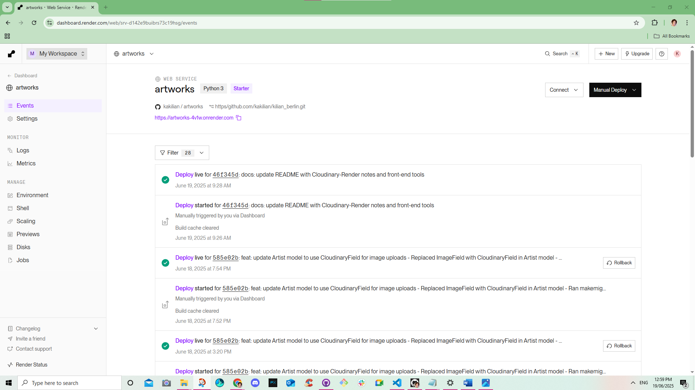
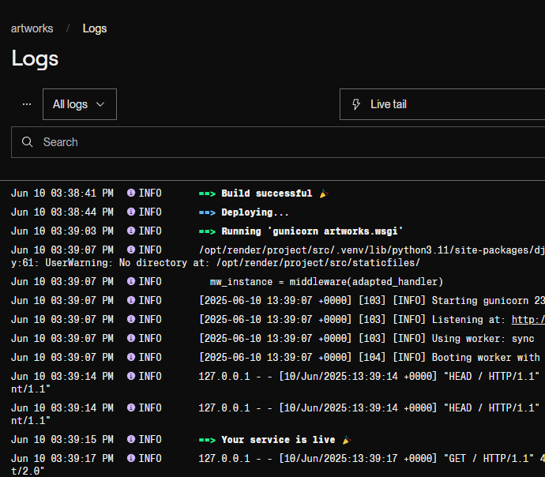
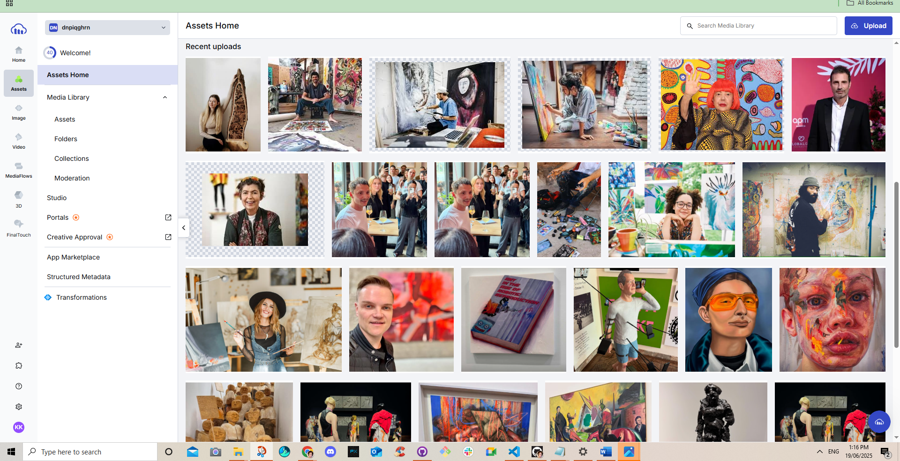
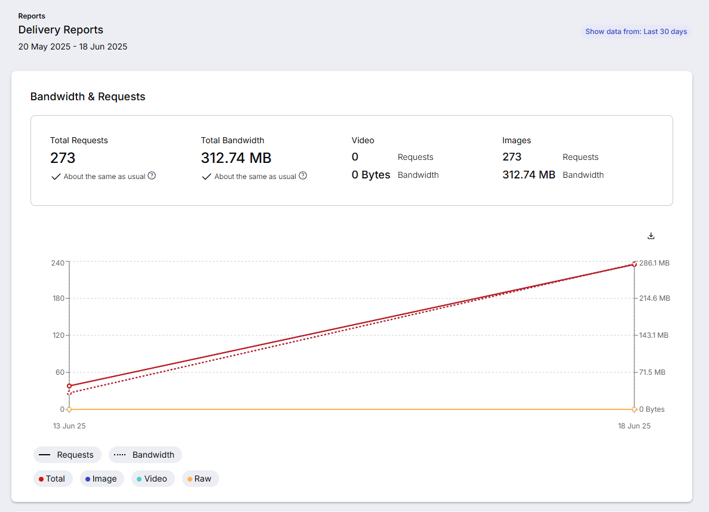
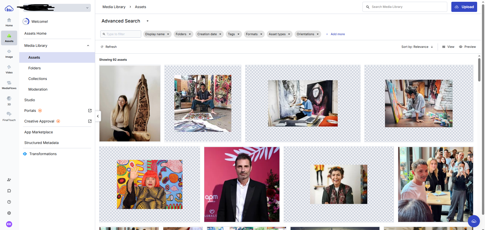

# 🚀 Deployment Guide

This document outlines the deployment process for the Artworks Django project, including hosting, static/media file handling, and environment configurations.

---

## 🌐 Hosting Platform: Render

The live site is hosted on [Render](https://render.com), which provides free-tier deployment for web services.

### Steps Taken:

1. **Pushed final project to GitHub**  
   Repo: [`https://github.com/kakilian/artworks`](https://github.com/kakilian/artworks)

2. **Created a new Web Service** on Render:
   - Selected "Deploy from GitHub"
   - Chose the `main` branch
   - Selected "Python" as the environment
   - Added the following build and start commands:
     ```
     Build Command: pip install -r requirements.txt && python manage.py collectstatic --noinput && python manage.py migrate
     Start Command: gunicorn artworks.wsgi:application
     ```

3. **Configured environment variables**:
   - `DEBUG=FALSE`
   - `SECRET_KEY=your_production_key_here`
   - `CLOUDINARY_URL=cloudinary://...`
   - `DATABASE_URL=...` *(if using Postgres)*

4. **Allowed Hosts** updated in `settings.py`:
   ```python
   ALLOWED_HOSTS = ['artworks-4v1w.onrender.com', 'localhost', '127.0.0.1']
````

5. **Static and Media Files**:

   * Static files collected using `collectstatic`
   * Media files served via **Cloudinary** (see below)

---

## ☁️ Media Handling: Cloudinary

To avoid storing media on Render’s ephemeral filesystem, Cloudinary was integrated.

### Integration steps:

1. Installed Cloudinary with:

   ```bash
   pip install cloudinary django-cloudinary-storage
   ```

2. Updated `settings.py`:

   ```python
   CLOUDINARY_STORAGE = {
       'CLOUD_NAME': 'your_cloud_name',
       'API_KEY': 'your_api_key',
       'API_SECRET': 'your_api_secret',
   }

   DEFAULT_FILE_STORAGE = 'cloudinary_storage.storage.MediaCloudinaryStorage'
   ```

3. Set `CLOUDINARY_URL` in the Render environment variables.

4. All artist and artwork images are now uploaded through the admin panel and stored externally via Cloudinary.

---

## ⚙️ Other Tools & Configs

* **Gunicorn** used as WSGI server on Render
* `whitenoise` for static file handling (if not using Cloudinary for static files)
* `requirements.txt` includes all deployment packages (gunicorn, dj-database-url, cloudinary, etc.)

---

## 🔗 Live Site

This is the deployed production version of the Artworks application:

🌐 [`https://artworks-4v1w.onrender.com`](https://artworks-4v1w.onrender.com)

---

> This deployment setup ensures that the app remains stable, scalable, and secure using a modern, cloud-based stack.

### 🛠️ Automated Deployment with `.render.yaml`

To automate the deployment process, I included a `.render.yaml` file in the root of the project. This file tells Render how to build and start the app directly from GitHub.

#### File location:

```txt
/render.yaml
```

#### Sample configuration:

```yaml
services:
  - type: web
    name: artworks
    env: python
    plan: free
    buildCommand: |
      pip install -r requirements.txt
      python manage.py collectstatic --noinput
      python manage.py migrate
    startCommand: gunicorn artworks.wsgi:application
    envVars:
      - key: DEBUG
        value: false
      - key: SECRET_KEY
        sync: false
      - key: CLOUDINARY_URL
        sync: false
      - key: DATABASE_URL
        sync: false
```

> *This configuration allows seamless builds and deployments directly from GitHub pushes — no need to trigger manually from the dashboard.*

---

## 🖼️ Render Deployment Screenshots

### 📌 Render Web Service Dashboard

This screenshot shows the live deployment status and the history of deploy events triggered via GitHub:



---

### 🧾 Live Deployment Logs

Below is the log output confirming a successful build and launch via `gunicorn`:



This log confirms:
- Static files were collected
- Gunicorn was launched via `artworks.wsgi`
- The service became live and was accessible at the assigned Render URL

---

## ☁️ Cloudinary Media Hosting

To manage and serve user-uploaded media files (like artist images and artworks), I integrated [Cloudinary](https://cloudinary.com), which offers fast and optimized image delivery.

All images are uploaded through the Django admin panel and automatically sent to Cloudinary’s remote storage, eliminating the need for local or Render-based media storage.

---

### 📁 Media Library & Folder Structure

To keep things organized, I created an **"Artists" folder** in Cloudinary. This helps separate artist profile pictures from general uploads and ensures faster retrieval during page rendering.



---

### 📊 Image Delivery Analytics

Cloudinary also provides analytics that track how much bandwidth is used and how many image requests are made. This graph shows total image traffic for the app over the last 30 days.



- **273 total image requests**
- **312.74 MB served** 
- _Data shown from: 20 May 2025 - 18 June 2025_
- Ensures fast and reliable performance across devices

---

### 🗂️ Asset Structure & Search

Assets are automatically tagged and sortable by folders and metadata in Cloudinary’s dashboard, making it easy to track down specific uploads and ensure optimal performance.



---

> _Overall, Cloudinary simplified the development process and gave me peace of mind that media would load fast, securely, and independently from Render’s limitations._
