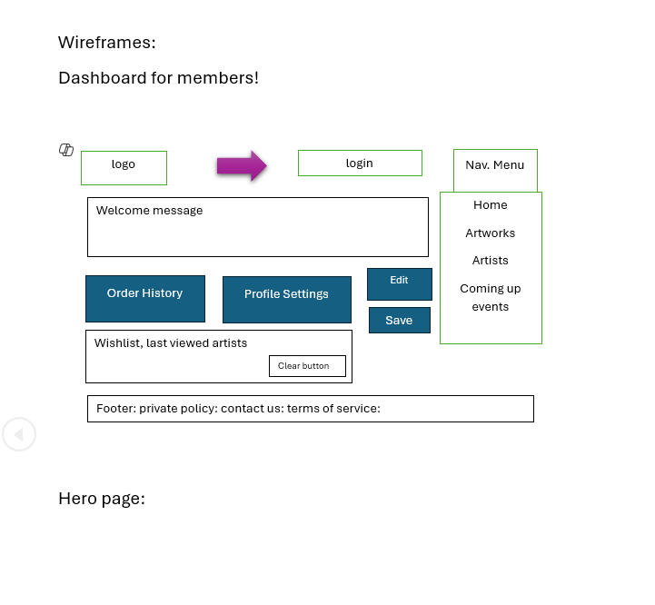
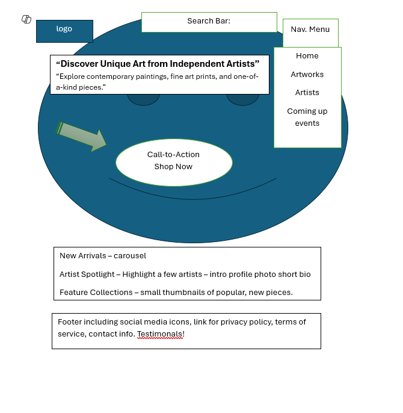
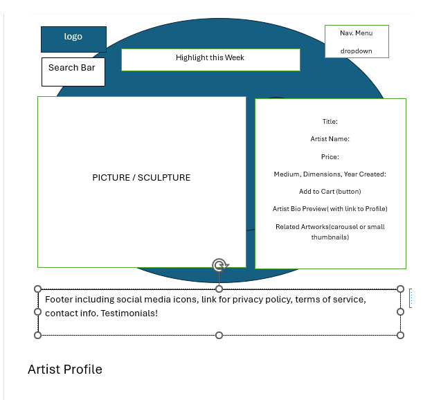
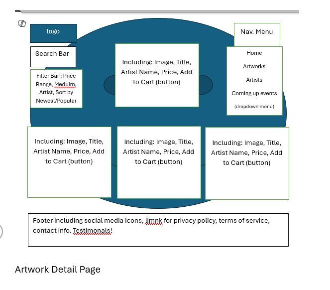
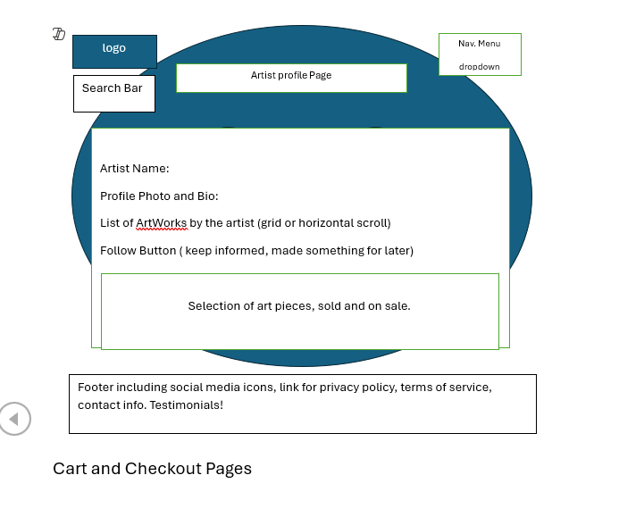
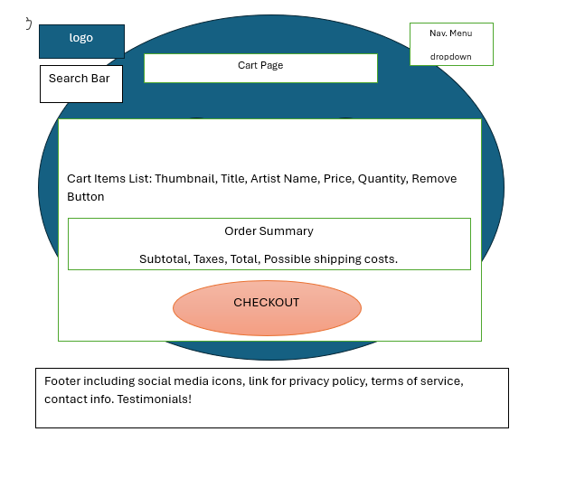

# 🎨 UX & UI Design

This document outlines the visual design process and user experience strategy behind the **Artworks** platform. All wireframes were created using Microsoft Word due to tool limitations but served their purpose in visualizing layout and flow.

---

## ✅ Wireframe to UI Matching

The final site adheres closely to the original wireframes, with some visual and structural improvements made during development:

| Wireframe Section  | Final Site Status       | Notes                                               |
|--------------------|-------------------------|-----------------------------------------------------|
| Hero Concept       | Not yet implemented     | Kept for potential future enhancement                         |
| Landing Page       | Fully implemented       | Added clickable featured images for better UX       |
| Artist Detail      | Fully implemented       | Adjusted image placement and bio spacing            |
| Artwork Detail     | Fully implemented       | Shows artwork info, price, and Add to Cart button   |
| Cart               | Fully implemented       | Responsive layout with item update functionality    |
| Checkout           | Fully implemented       | Stripe integration added and tested                 |

This table illustrates how the wireframes translated into working features, with real-time decisions improving usability and responsiveness.

## 🖼️ Wireframe Gallery

### Hero Page (Planned)

While not yet implemented, this concept was meant to serve as a dramatic entry into the site.

 

---

### Landing Page

The homepage was designed mobile-first with space for featured artworks and clear navigation.

---

### Artist Page

Focuses on an individual artist's image and biography, followed by their artwork.

---

### Artwork Page

Displays artwork, pricing, dimensions, and an option to add to cart.

---

### Cart Page

Shows the current basket with options to update or remove items.

---

### Checkout Page

Simplified layout to finalize the purchase through Stripe integration.

---

## 💭 Design Process Reflection

While the original wireframes were made in Word and visually simple, they provided structure and direction. Over the course of development, adjustments were made for:
- Better spacing and layout on mobile
- Improved alignment of artwork images and artist bios
- Enhancements to dropdown nav and cart experience

---